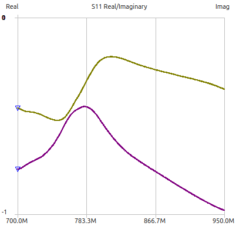

# Notes
## Setup
- Sweep frequency: 700 - 950 MHz
- Default coax connection with phase delay -1.6ns (as calibrated)

### Initial Measurement

### Initial Changes

The return loss is minimal at around 780 MHz. Try adapting the matching circuit to achieve a better return loss at 868 MHz.
