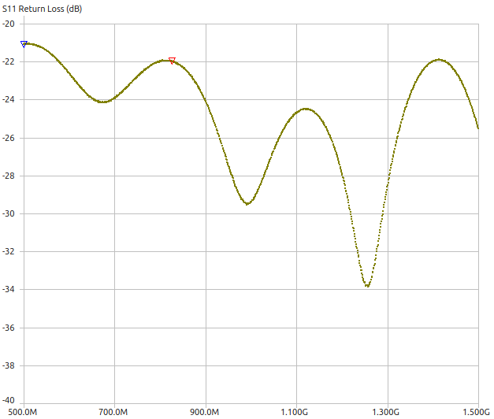
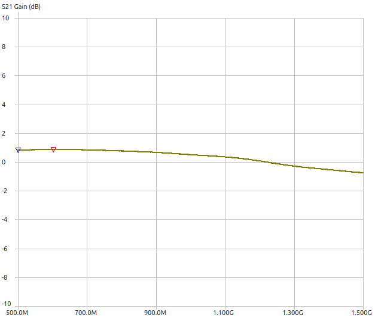
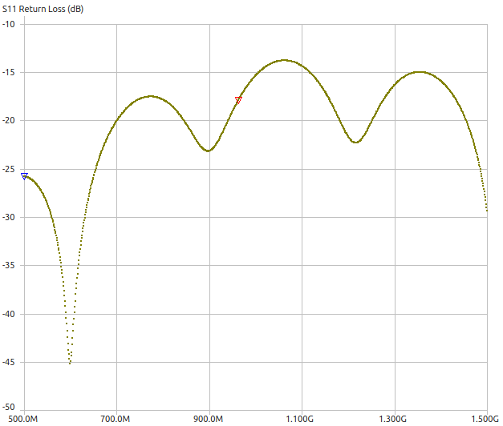

# Notes
## VNA Bringup and calibration
### VNA version and software
- The VNA used here to measure the transfer function is the LiteVNA, which has a range from 50 kHz to 6.3 GHz.
- The software used is called [nanovna-saver](https://github.com/NanoVNA-Saver/nanovna-saver)

### Wire checks
To check how much results vary with different COAXes we try performing the experiments with 2 varieties of coax-cables
- A 35 cm SS405 COAX cable delivered with the NanoVNA
- An equally long 35 cm coax bought from aliexpress, with female to male adapter attached [link](https://www.aliexpress.com/store/3516063?spm=a2g0o.order_list.order_list_main.52.1b415c5fTypAqu)

**Test Settings**
- Sweep between 500 MHz and 1.5 GHz
- Enable 1024 Testpoints (Serial port control > Manage > Datapoints)
- Logarithmic sweep (averaged)
- Number of measurements to average: 3 (multiple x 1024 measurements made)

Images as well as touchstone parameters can be found in the VNA-folder.

**Default Wire**

**Other wire**

**Conclusion**

The bought wire seems to have quite some more return loss.

### Calibration types
WARNING: Make sure to connect the right end-coaxes depending on which calibration is ongoing (open, load, short).

#### Short calibration
Connecting 2 ports using a 50 ohm COAX
- For a 2-port calibration, make sure to connect 2 coaxes together here.
- A short coax-connector comes with the nanovna

#### Load calibration
Terminate both ends with a known 50 ohm end, check reflections.
- There's a 50 ohm termination that comes with the NanoVNA.

#### Isolation calibration
Making sure there is no input signal between ports (measuring crosstalk / leakage in the system) -> often also by ataching 2 isolated loads.
- An isolated coax connector comes with the NanoVNA

#### Thrurefir Calibration

## Electrical delay
### Description
- This should normally be a linear function of the frequency in an ideal transmission line.
	- The electrical delay / group delay $\tau = \frac{d\phi}{d\omega} = \frac{l}{v_{p}}$
	- So the electrical delay is rate of phase shift change with frequency. 

### Method for a single port
- Make sure to short the end of the cable
	- We got a short together with the NanoVNA
- Measure the phase response
- Then compensate for this phase response

NOTE: This group delay is constant for that specific medium, of that specific length for all frequencies.

### Method for dual port 
For this purpose the FULL calibration needs to be done!!!
- Full 2-port SOLT (open, short, load on each port)

**Observation**
- The group delay / Phase shift for the reference coax should be set to -1.6ns.
- The group delay / Phase shift for the is offset by an "offset delay"-parameter of -1.7 ns.
	- The group delay is clearly a sinusoidal function of frequency in this case, more than the default supplied coax.

## Naming conventions
- S1P files are named as <parameter_measured>_<coax/nocoax>_<measurement_version>.s1p

e.g.: S11_coax_v0.s1p means
- Means the single-port measurement was done with 
	- a coax attached to the port
	- the calibration done with the coax attached
	- the measurement version: the notes should describe what exactly was changed with respect to the previous version.

# Questions
## 2-port group delay
Can we set a 3.2 ns as the port-1 group delay, but connect both endpoints with a 1.6 ns group-delay transmission line? Or should we absolutely have 2 separate delays on each port?

We can't, since a phase-delay propagating through the DUT might come out differently in port 2 then if the phase delay was applied at port 2.

## Differences in 2-port calibration vs single-port calibration
For some reason when doing 2-port calibration the measured results are completely off from a single-port calibration situation. 
Although I am using the exact same data for the first 3 tests for port 1 (short, open, loaded)

# Sources
- https://www.microwaves101.com/encyclopedias/network-analyzer-measurements
- NanoVNA reliability: http://thestone.zone/radio/2021/12/22/trusting-nanovna.html
